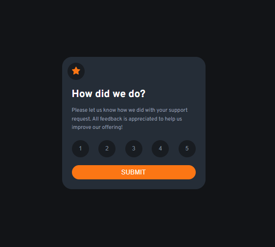
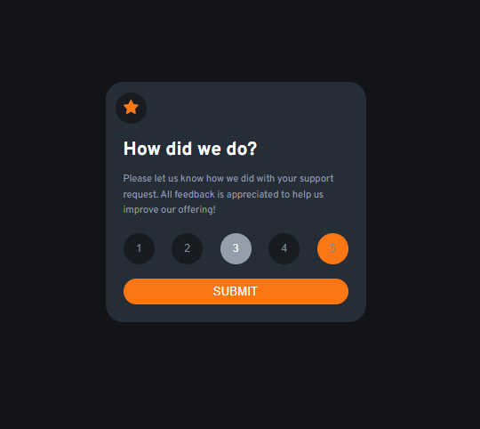
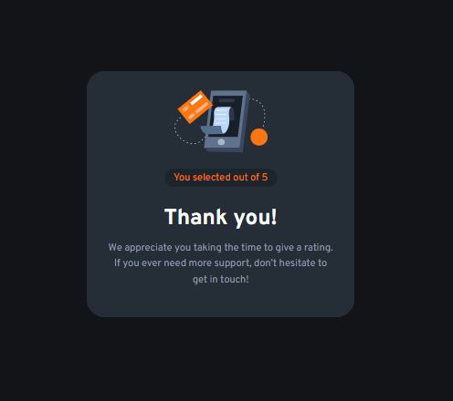

# Frontend Mentor - Interactive rating component

This is a solution to the [Interactive rating component
](https://www.frontendmentor.io/challenges/interactive-rating-component-koxpeBUmI). Frontend Mentor challenges help you improve your coding skills by building realistic projects.

## Table of contents

- [Overview](#overview)
  - [The challenge](#the-challenge)
  - [Screenshot](#screenshot)
  - [Links](#links)
- [My process](#my-process)
  - [Built with](#built-with)
  - [What I learned](#what-i-learned)
  - [Continued development](#continued-development)
- [Author](#author)
- [Acknowledgments](#Acknowledgments)

## Overview

### The challenge

This is a nice, small project to practice handling user interactions and updating the DOM. Perfect for anyone who has learned the basics of JavaScript!

Your users should be able to:

- Select and submit a number rating
- See the "Thank you" card state after submitting a rating
- See hover and focus states for all interactive elements on the page

### Screenshot

### Links

- Solution URL: [here](https://github.com/olahasan/HTML_CSS_AND_J.S_Frontend-Mentor_NEWBIE-Interactive-rating-component)

- Live Site URL: [here](https://olahasan.github.io/HTML_CSS_AND_J.S_Frontend-Mentor_NEWBIE-Interactive-rating-component/)

## My process

### Built with

- Semantic HTML5 markup
- CSS custom properties
- Flexbox
- JavaScript

### What I Learned

In this project, I learned how to create an interactive component using JavaScript to handle user input and dynamically update the UI. I also improved my skills in CSS for styling and layout.

### Continued Development

I plan to continue improving this project by adding more accessibility features and refining the design based on user feedback. and improve my skills in JS

### Author

Frontend Mentor - @olahasan 
GitHub - @olahasan

### Acknowledgments

I would like to thank the **Frontend Mentor** for providing this challenge and to the community for their support and feedback
